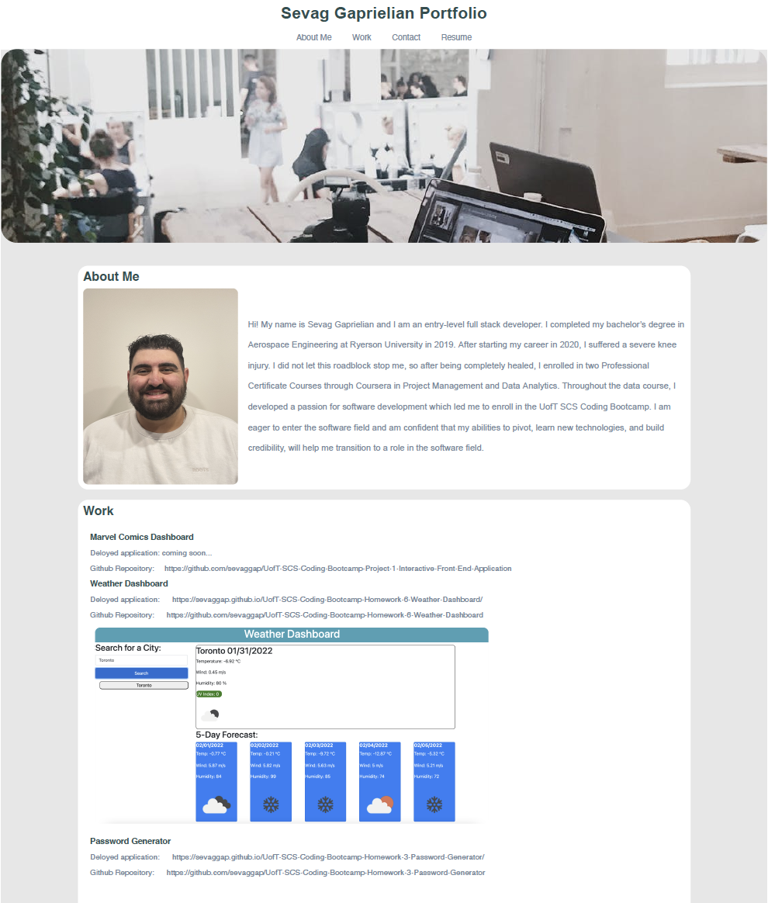

# UofT-SCS-Coding-Bootcamp-Homework-2-Professional-Portfolio

## Description

The purpose of this project was to create a protfolio webiste from scratch. We were not given any started code for this project, and had to design all aspects of the layout ourselves. A portfolio is important, as it can showcase your skills to employers and highlight your strongest work. Students who have portfolio are very successful in their career serach after the boot camp. 

## Installation
 Download the repository and open the index.html. Be sure to download all the files as the photos will not load if not included in the directory.

## Usage
The following image shows the web application's appearance and functionality:

## Credits
Uoft SCS Coding Bootcamp Gitlab

## License
Copyright [2021] [Sevag Gaprielian]

Licensed under the Apache License, Version 2.0 (the "License"); you may not use this file except in compliance with the License.
You may obtain a copy of the License at http://www.apache.org/licenses/LICENSE-2.0.

Unless required by applicable law or agreed to in writing, software
distributed under the License is distributed on an "AS IS" BASIS,
WITHOUT WARRANTIES OR CONDITIONS OF ANY KIND, either express or implied.
See the License for the specific language governing permissions and
limitations under the License.

## GitHub and Link to Deployed Application
Github: sevaggap
 
Application: